# FordCare Intelligence
# Sprint 3 — Cybersecurity

## Integrantes

- Luan Orlandelli Ramos — RM 554747
- Jorge Luiz Silva Santos — RM 554418
- Arthur Bobadilla Franchi — RM 555056

---

# 1. Visão Geral

O FordCare Intelligence é uma solução voltada ao apoio das operações de pós-venda, retenção e relacionamento com clientes.

A arquitetura integra backend REST, aplicação mobile, banco de dados PostgreSQL, autenticação JWT, controle de acesso baseado em papéis, containers Docker e uma camada de observabilidade baseada em Spring Actuator, Micrometer, Prometheus e Grafana.

Na Sprint 3, a segurança foi trabalhada de forma transversal, abrangendo desenvolvimento, integração contínua, infraestrutura, autenticação, autorização, monitoramento, resposta a incidentes, gestão de riscos e recuperação.

Os quatro grupos trabalhados foram:

1. Pipeline DevSecOps Integrado;
2. Segurança em Código e Infraestrutura;
3. Observabilidade, Monitoramento e Resposta;
4. Compliance, Riscos e Segurança Contínua.

---

# 2. Arquitetura de Segurança

A arquitetura de segurança do FordCare Intelligence pode ser representada pelo seguinte fluxo:

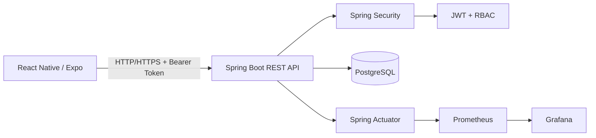

Os principais controles incluem:

- autenticação JWT;
- RBAC;
- BCrypt;
- validação de entrada;
- rate limiting;
- tratamento seguro de erros;
- externalização de secrets;
- auditoria;
- containers endurecidos;
- monitoramento;
- alertas;
- backup e recuperação.

---

# 3. Pipeline DevSecOps Integrado

O projeto utiliza GitHub Actions para executar automaticamente verificações de qualidade e segurança.

Arquivo:

`.github/workflows/security-ci.yml`

## 3.1 Fluxo do pipeline

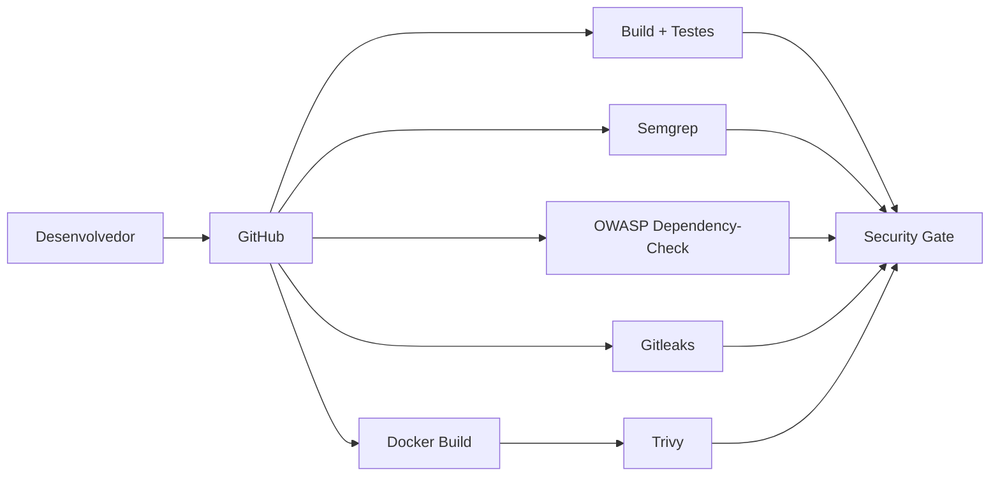

## 3.2 SAST

Foi utilizado **Semgrep** para análise estática do código.

Objetivo:

- identificar padrões inseguros;
- detectar problemas antes da implantação;
- automatizar verificações de segurança durante o desenvolvimento.

Resultado final:

**APROVADO**

---

## 3.3 SCA

Foi utilizado **OWASP Dependency-Check** para análise das dependências utilizadas pela aplicação.

O objetivo é identificar componentes de terceiros associados a vulnerabilidades conhecidas.

Resultado final:

**APROVADO**

---

## 3.4 Secret Scanning

Foi utilizado **Gitleaks** para verificar a presença de credenciais e secrets no repositório.

Resultado final:

`No leaks detected`

Status:

**APROVADO**

---

## 3.5 Container Security

A imagem Docker da aplicação é analisada pelo **Trivy**.

Durante o ciclo de validação, o scanner identificou vulnerabilidades em dependências da aplicação.

Os componentes foram revisados e atualizados até que a execução final do pipeline fosse aprovada.

Essa etapa demonstra o funcionamento real do processo DevSecOps:

```text
Detecção → Análise → Correção → Novo Scan → Aprovação
```

Resultado final:

**APROVADO**

---

## 3.6 Security Gate

O Security Gate depende do sucesso das etapas obrigatórias de segurança.

Resultado da execução final:

- Build e Testes — APROVADO;
- Semgrep — APROVADO;
- OWASP Dependency-Check — APROVADO;
- Gitleaks — APROVADO;
- Trivy — APROVADO;
- Security Gate — APROVADO.

Status final do workflow:

**SUCCESS**

---

# 4. Segurança em Código e Infraestrutura

## 4.1 Validação de entradas

A aplicação utiliza Bean Validation para validação dos dados recebidos.

Além disso, foram definidos limites de payload para reduzir riscos associados a requisições excessivamente grandes.

---

## 4.2 SQL Injection

O acesso ao banco é realizado utilizando Spring Data JPA e mecanismos parametrizados de persistência.

Essa abordagem reduz a necessidade de concatenação manual de comandos SQL e ajuda a mitigar ataques de SQL Injection.

---

## 4.3 Tratamento seguro de erros

O `GlobalExceptionHandler` centraliza o tratamento de exceções.

Respostas internas inesperadas não devem expor stack traces ou informações sensíveis da aplicação ao cliente.

---

## 4.4 JWT

A autenticação utiliza JWT.

O token contém informações necessárias para identificação e autorização do usuário.

A chave JWT:

- não permanece hardcoded;
- é recebida por variável de ambiente;
- possui validação mínima de tamanho;
- utiliza assinatura HMAC.

O token possui expiração configurada.

---

## 4.5 RBAC

Foram implementados três perfis:

- `ADMIN`;
- `ANALYST`;
- `DEALER_MANAGER`.

O Spring Security restringe endpoints conforme o perfil autenticado.

Os testes automatizados verificam:

- requisição sem token → HTTP 401;
- ADMIN autorizado → HTTP 200;
- DEALER_MANAGER autorizado → HTTP 200;
- ANALYST sem permissão em `/leads` → HTTP 403.

---

## 4.6 Rate Limiting

O projeto utiliza Bucket4j para limitar o número de requisições.

A configuração atual aplica limite de requisições por endereço IP.

Eventos de excesso de requisições são registrados para auditoria.

---

## 4.7 CORS

O CORS é configurado no Spring Security de forma controlada, evitando uma política aberta indiscriminadamente.

---

## 4.8 HTTPS/TLS

Durante o desenvolvimento local, a aplicação utiliza HTTP.

Entretanto:

- o suporte TLS permanece disponível;
- o keystore foi retirado do código-fonte;
- o caminho do keystore é externalizado;
- a senha é recebida por variável de ambiente.

Em produção, certificados e chaves devem ser injetados por mecanismo seguro.

---

## 4.9 MQTT/TLS

O FordCare Intelligence não possui componentes MQTT ou dispositivos IoT na arquitetura atual.

Portanto:

**NÃO APLICÁVEL À ARQUITETURA ATUAL**

Não foi criado um componente fictício apenas para atender ao item.

---

# 5. Segurança Mobile

A aplicação cliente utiliza React Native com Expo e também possui suporte à execução web.

Entre os controles adotados estão:

- armazenamento do JWT com Expo SecureStore nas plataformas nativas;
- remoção automática do token armazenado quando a API retorna HTTP 401;
- envio do JWT pelo header `Authorization: Bearer`;
- URL da API externalizada por meio de `EXPO_PUBLIC_API_URL`;
- ausência de credenciais privadas no código-fonte e no bundle mobile;
- arquivo `.env` excluído do versionamento;
- disponibilização apenas de `.env.example` como modelo de configuração;
- timeout configurado nas requisições realizadas à API;
- autorização efetivamente validada pelo backend por meio do Spring Security e RBAC.

A variável `EXPO_PUBLIC_API_URL` contém somente o endereço público da API. Secrets como `JWT_SECRET`, senha do banco de dados e senha do keystore não são armazenados no frontend.

Foi realizada uma busca no código-fonte do frontend por referências a secrets e credenciais hardcoded. Nenhuma credencial privada foi identificada.

A configuração do projeto também foi validada pelo Expo Doctor, apresentando:

`18/18 checks passed. No issues detected!`

O ESLint foi executado sobre o frontend e apresentou:

`0 errors`

Os avisos restantes são relacionados a qualidade/estilo de código e não representam falhas de segurança identificadas.

Durante a validação local, frontend, API Spring Boot e PostgreSQL foram executados de forma integrada, permitindo validar autenticação e acesso aos recursos protegidos.

Em ambiente local de desenvolvimento, a comunicação pode utilizar HTTP. Para produção, a comunicação entre aplicativo e API deve utilizar HTTPS.

---

# 6. Secrets e Configuração

Informações sensíveis foram externalizadas.

Entre elas:

- senha do PostgreSQL;
- JWT secret;
- senha do keystore;
- localização do keystore.

Arquivos `.env`, certificados, chaves privadas, logs e outros artefatos sensíveis são excluídos do versionamento e/ou do contexto de build.

No frontend, somente o arquivo `.env.example` permanece disponível como referência de configuração, enquanto o `.env` real é ignorado.

O Gitleaks foi incorporado ao pipeline para detectar possíveis vazamentos.

A execução final apresentou:

`No leaks detected`

---

# 7. Segurança de Containers

O Dockerfile utiliza abordagem multi-stage.

Entre os controles implementados estão:

- separação entre build e runtime;
- usuário não-root;
- `no-new-privileges`;
- `.dockerignore`;
- health check;
- imagem submetida ao Trivy;
- PostgreSQL isolado na rede Docker;
- porta do PostgreSQL não publicada diretamente no host no ambiente Docker Compose.

---

# 8. Logging e Auditoria

Eventos relevantes de segurança são registrados.

Eventos implementados:

- `LOGIN_SUCCESS`;
- `LOGIN_FAILED`;
- `UNAUTHORIZED_ACCESS`;
- `ACCESS_DENIED`;
- `RATE_LIMIT_EXCEEDED`;
- `CUSTOMER_ANONYMIZED`.

Os registros podem conter:

- ação;
- usuário;
- endpoint;
- IP;
- timestamp.

Falhas no mecanismo de auditoria não devem interromper a operação principal da API.

---

# 9. Observabilidade

A arquitetura de observabilidade utiliza:

- Spring Boot Actuator;
- Micrometer;
- Prometheus;
- Grafana.

Fluxo:

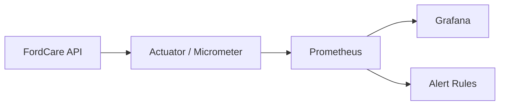

O Actuator opera em porta de gerenciamento separada no ambiente configurado.

O Prometheus coleta as métricas da aplicação e o Grafana apresenta o dashboard:

`FordCare Intelligence — Security & Observability`

---

# 10. Métricas

Foram validadas métricas relacionadas a:

- disponibilidade;
- CPU;
- memória JVM;
- requisições por segundo;
- HTTP 4xx;
- HTTP 5xx;
- latência p95;
- conexões com banco;
- eventos WARN/ERROR.

O target:

`fordcare-api`

foi validado como:

`UP`

A consulta:

`up{job="fordcare-api"}`

retornou:

`1`

---

# 11. Alertas

Foram configuradas três regras principais.

## FordCareApiDown

Detecta indisponibilidade da API.

Condição:

API indisponível por 1 minuto.

## FordCareHighServerErrorRate

Detecta crescimento da proporção de erros HTTP 5xx.

Condição:

mais de 5% de respostas 5xx durante o período configurado.

## FordCareHighJvmMemory

Detecta consumo elevado do heap da JVM.

Condição:

utilização superior a 85% durante o período configurado.

Durante a validação saudável do ambiente, as regras estavam carregadas e em estado `INACTIVE`, comportamento esperado quando nenhuma condição de incidente está ocorrendo.

---

# 12. Resposta a Incidentes

O processo está documentado em:

`docs/security/INCIDENT_RESPONSE.md`

Fluxo:

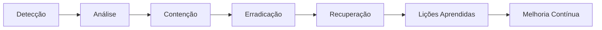

O processo permite relacionar alertas e eventos de auditoria com ações operacionais de resposta.

---

# 13. Threat Modeling — STRIDE

O modelo de ameaças está documentado em:

`docs/security/THREAT_MODEL.md`

Foi utilizada a metodologia STRIDE.

## Spoofing

Risco de falsificação de identidade.

Controles:

- JWT;
- BCrypt;
- autenticação;
- rate limiting;
- auditoria.

## Tampering

Risco de alteração indevida de informações.

Controles:

- validação;
- JPA;
- RBAC;
- JWT;
- TLS para produção.

## Repudiation

Risco de negação de ações realizadas.

Controles:

- audit logs;
- eventos de autenticação;
- registro de acessos negados;
- timestamps.

## Information Disclosure

Risco de exposição de informações.

Controles:

- externalização de secrets;
- RBAC;
- tratamento seguro de erros;
- TLS;
- anonimização;
- isolamento dos serviços de infraestrutura.

## Denial of Service

Risco de indisponibilidade.

Controles:

- rate limiting;
- limites de payload;
- métricas;
- alertas;
- health checks.

## Elevation of Privilege

Risco de obtenção indevida de privilégios.

Controles:

- RBAC;
- Spring Security;
- testes de autorização;
- auditoria.

---

# 14. Compliance e Referências de Segurança

Documento:

`docs/security/COMPLIANCE.md`

Foram utilizados como referência:

- OWASP ASVS;
- OWASP API Security Top 10;
- OWASP Mobile Top 10;
- LGPD.

---

# 15. LGPD

Foram implementados controles técnicos relacionados à proteção de dados, incluindo:

- autenticação;
- autorização;
- auditoria;
- anonimização;
- proteção de secrets;
- monitoramento;
- resposta a incidentes;
- backup e recuperação.

A API possui operação de anonimização de cliente.

Os controles implementados apoiam a proteção dos dados tratados pelo sistema, mas não representam, isoladamente, uma declaração de conformidade jurídica integral com a LGPD.

---

# 16. Backup e Recovery

Documentação:

`docs/security/BACKUP_RECOVERY.md`

Scripts:

`scripts/backup-db.ps1`

`scripts/restore-db.ps1`

Foi executado um backup real do PostgreSQL.

Posteriormente, o arquivo foi restaurado em um banco isolado criado especificamente para o teste.

A validação confirmou a recuperação de dez tabelas:

- audit_logs;
- customers;
- dealerships;
- flyway_schema_history;
- leads;
- predictions;
- recommendations;
- roles;
- users;
- vehicles.

Após a validação, o banco temporário foi removido.

Foram definidos como objetivos acadêmicos:

- RPO: 24 horas;
- RTO: 4 horas.

Esses valores representam objetivos propostos para o projeto e não métricas de um ambiente produtivo real.

---

# 17. Segurança Contínua

Documento:

`docs/security/CONTINUOUS_SECURITY.md`

A estratégia contempla:

- execução contínua dos testes;
- SAST;
- SCA;
- secret scanning;
- container scanning;
- Security Gate;
- revisão de permissões;
- monitoramento;
- gestão de vulnerabilidades;
- backup;
- testes de recuperação;
- revisão do Threat Model.

A segurança passa a fazer parte do ciclo de desenvolvimento em vez de ser tratada apenas como uma verificação realizada ao final do projeto.

---

# 18. Evidências da Sprint

Esta seção consolida as principais evidências obtidas durante a implementação e validação dos controles de segurança da Sprint 3.

## 18.1 Pipeline DevSecOps

A execução final do GitHub Actions foi concluída com sucesso em todos os jobs obrigatórios:

- Build e Testes;
- SAST — Semgrep;
- SCA — OWASP Dependency-Check;
- Secret Scanning — Gitleaks;
- Container Security — Trivy;
- Security Gate.

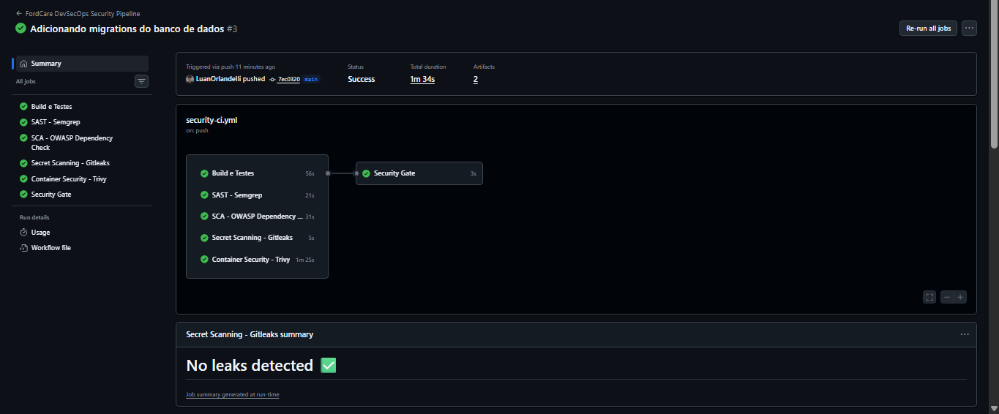

---

## 18.2 Testes automatizados

O backend foi validado com 16 testes automatizados:

- 16 testes executados;
- 0 failures;
- 0 errors;
- BUILD SUCCESS.

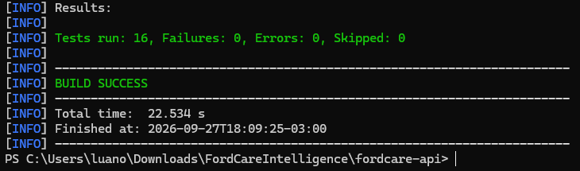

---

## 18.3 Prometheus

O Prometheus identificou corretamente a API como disponível.

Target:

`fordcare-api — UP`

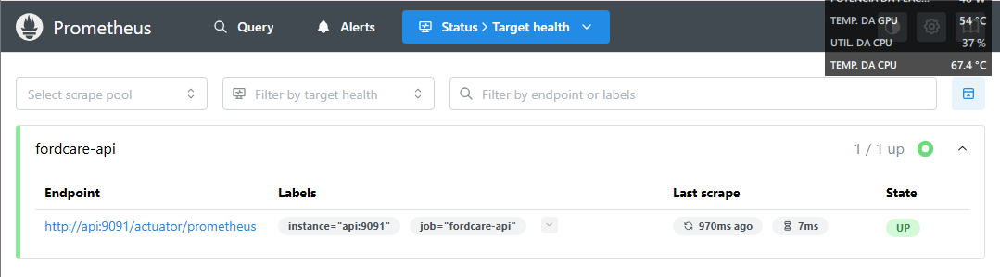

A consulta:

`up{job="fordcare-api"}`

retornou:

`1`

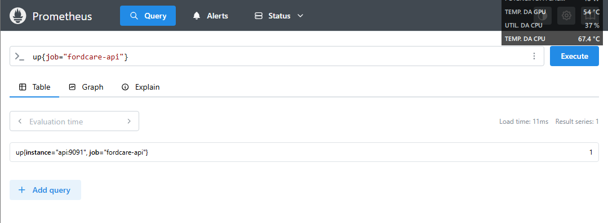

---

## 18.4 Dashboard de Observabilidade

O Grafana foi configurado com o dashboard:

**FordCare Intelligence — Security & Observability**

O dashboard permite acompanhar métricas relacionadas à aplicação e à infraestrutura.

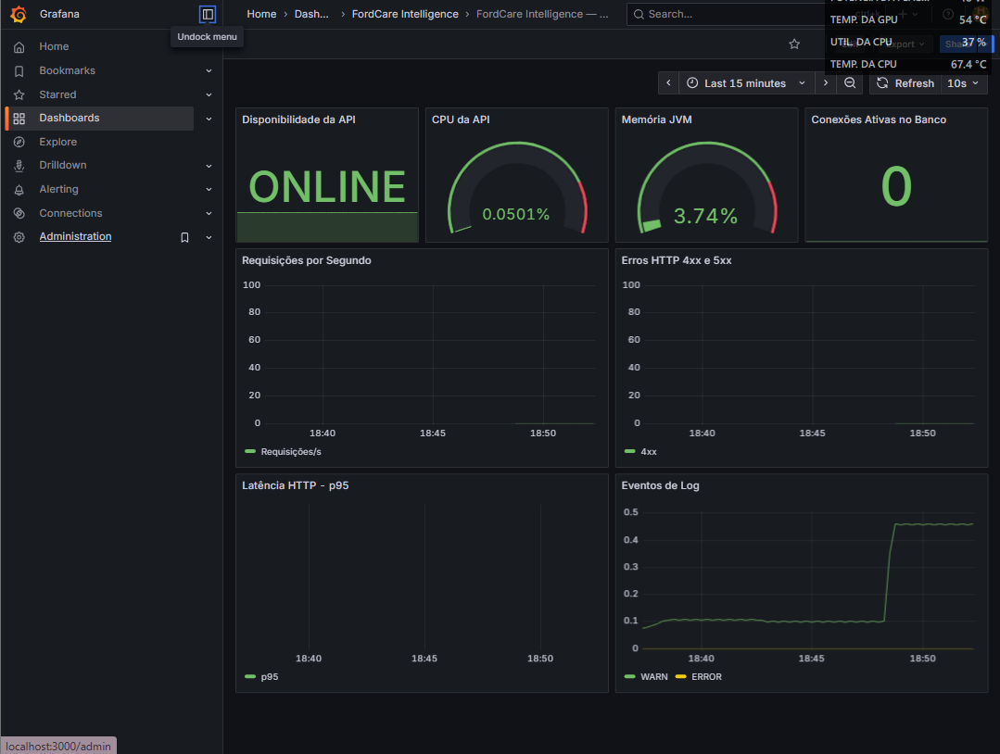

---

## 18.5 Alertas

Foram configuradas regras de alerta para:

- indisponibilidade da API;
- crescimento da taxa de erros HTTP 5xx;
- utilização elevada de memória JVM.

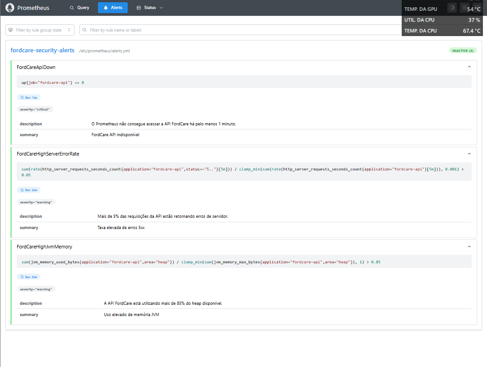

---

## 18.6 Logs e Auditoria

Foram implementados registros para eventos relevantes de segurança, incluindo:

- LOGIN_SUCCESS;
- LOGIN_FAILED;
- UNAUTHORIZED_ACCESS;
- ACCESS_DENIED;
- RATE_LIMIT_EXCEEDED;
- CUSTOMER_ANONYMIZED.

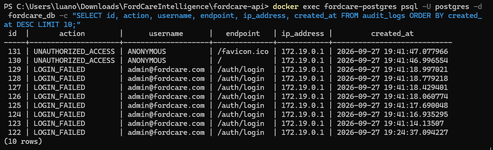

---

## 18.7 Backup e Recuperação

Foi realizado backup real do PostgreSQL e posteriormente executado um teste de restauração em banco isolado.

A recuperação confirmou a presença das 10 tabelas esperadas.

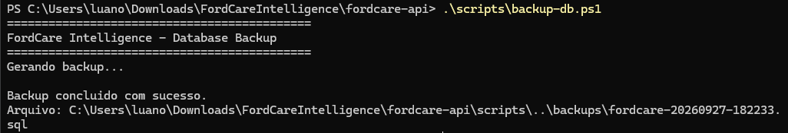

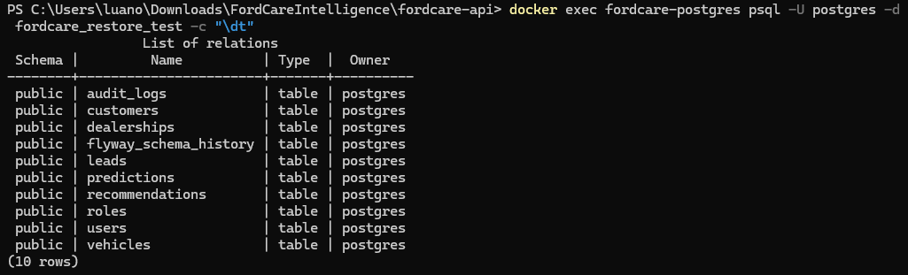

---

## 18.8 Segurança do Frontend

O frontend foi validado utilizando Expo Doctor:

`18/18 checks passed. No issues detected!`

Também foi executado ESLint com:

`0 errors`

A busca por credenciais hardcoded não identificou secrets privados no código-fonte.

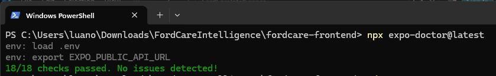

---

# 19. Resultado do Pipeline

A execução final do pipeline apresentou todos os jobs obrigatórios em estado aprovado:

```text
Build e Testes                    PASS
SAST — Semgrep                    PASS
SCA — OWASP Dependency-Check      PASS
Secret Scanning — Gitleaks        PASS
Container Security — Trivy        PASS
Security Gate                     PASS
```

O resultado demonstra que a aplicação passou pela cadeia automatizada de verificações definida para a Sprint.

---

# 20. Cuidados de Produção

Algumas características do ambiente acadêmico/local não devem ser reproduzidas diretamente em produção.

Recomendações:

- habilitar HTTPS com certificado válido;
- proteger a porta de gerenciamento;
- restringir acesso ao Prometheus;
- proteger o Grafana;
- utilizar cofre de secrets;
- aplicar política formal de rotação de credenciais;
- armazenar backups criptografados fora do servidor principal;
- definir retenção formal de logs;
- configurar proxy confiável para tratamento correto do IP de origem;
- revisar periodicamente dependências e permissões;
- testar periodicamente o processo de restore;
- utilizar HTTPS na comunicação entre o aplicativo mobile e a API;
- manter secrets privados exclusivamente no backend ou em mecanismos apropriados de gestão de secrets.

---

# 21. Conclusão

A Sprint 3 ampliou o FordCare Intelligence de uma aplicação funcional para uma arquitetura com segurança integrada ao ciclo de desenvolvimento e operação.

O projeto passou a contar com:

- pipeline DevSecOps;
- testes automatizados;
- SAST;
- SCA;
- secret scanning;
- container scanning;
- Security Gate;
- autenticação JWT;
- RBAC;
- rate limiting;
- auditoria;
- armazenamento seguro do token nas plataformas mobile;
- externalização das configurações do frontend e backend;
- observabilidade;
- alertas;
- resposta a incidentes;
- threat modeling;
- controles relacionados à LGPD;
- backup e recuperação;
- estratégia de segurança contínua.

A execução final do GitHub Actions foi concluída com sucesso em todos os jobs obrigatórios, demonstrando a execução prática do pipeline de segurança definido para o projeto.

Além disso, o frontend foi validado com Expo Doctor, ESLint e execução integrada com a API, complementando os controles de segurança aplicados ao backend e à infraestrutura.

O resultado da Sprint é uma solução com controles de segurança distribuídos entre aplicação, autenticação, autorização, desenvolvimento, infraestrutura, monitoramento e recuperação, acompanhados por documentação técnica e evidências de execução.